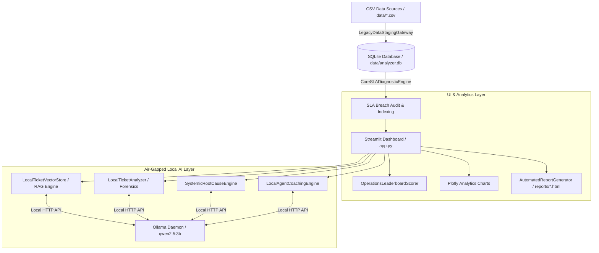

# 🛡️ Enterprise SRE & IT Operations Intelligence Platform

> **Air-Gapped, Local AI-Powered Agent Performance Analyzer & IT Operations Diagnostics Suite**


The **Enterprise SRE & IT Operations Intelligence Platform** is an end-to-end operational analytics engine designed for SRE, IT Service Management (ITSM), and Operations leadership. It ingests ticket datasets, audits SLA compliance, calculates multi-factor agent leaderboard rankings, clusters infrastructure noise, surfaces historical resolutions via an in-memory vector RAG engine, and performs deep LLM ticket forensics—all completely local and air-gapped without relying on external cloud APIs.

---

## 🌟 Key Features

### 1. 🎛️ Operations Control Panel & Dynamic Filtering
- **Multi-Dataset Ingestion**: Select and sync dynamically from any `.csv` file in the `data/` folder directly into SQLite storage.
- **Context-Aware Filtering**: Filter metrics by Date Range, Target Company, Ticket Classification (Service Requests vs Incidents), SRE Agent, and Severity.
- **⏱️ Minute-Wise Resolution Duration Filter**: Exclude tickets resolved below a configurable minute-wise threshold (default: 5 minutes) to strip out instant automated closes for accurate agent performance evaluation.
- **🔀 Merged Ticket Scope Controls**: Choose to **Exclude Merged Tickets** (default), view **All Tickets (Merged & Unmerged)**, or isolate **Only Merged Tickets** for audit.
- **Automated Bot Exclusion**: Automatically filters out system closures (`Auto-Resolve`, `System Agent`, `bot`) to prevent metric skew.

### 2. 📊 Executive Operations KPIs & Diagnostics
- **Real-Time KPI Dashboard**: Live tracking of Total Scope Volume, Global SLA Compliance %, Resolution Breach Counts, and Average Resolution Time.
- **Workflow & Workload Visualizations**: Interactive Plotly visualizations for Severity Priority Distributions and SRE Agent Workload Allocations.
- **Chronological Leadership Tracker**: Month-over-month operational performance tracker isolating top SRE performers and fastest resolvers.

### 3. 🏆 Context-Aware Performance Leaderboard
- Dynamic weighted scoring algorithm that adapts based on work type:
  - **Incidents**: Prioritizes SLA Compliance (50%) and Resolution Speed (35%).
  - **Service Requests**: Prioritizes Volume Handled (40%) and Effort Efficiency (20%).
  - **Balanced/All**: Balanced evaluation across SLA, Speed, Volume, and Effort.

### 4. 🧠 Local AI & RAG Engineering Engine (Ollama Air-Gapped)
- **Zero-Dependency Vector Store RAG (`ai/rag_engine.py`)**: Lightweight 384-dimensional native frequency hashing vector store to surface similar past resolved tickets via Cosine Similarity.
- **LLM Forensic Ticket Investigator (`analytics/ticket_ai.py`)**: Uses local `qwen2.5:3b` LLM inference via Ollama to identify handoff process errors, technical root causes, and workflow optimization plans.
- **Systemic Root Cause Engine (`analytics/root_cause.py`)**: Clusters operational noise and high-volume ticket patterns to generate infrastructure security playbooks.
- **Agent Coaching Workshop (`analytics/insights.py`)**: Generates personalized AI coaching profile assessments for individual engineers based on historical ticket logs.

### 5. 📋 Automated Executive Report Generator
- One-click compilation of standalone executive HTML operations summary reports saved directly to `reports/`.

---

## 🏗️ System Architecture



---

## 📁 Repository Directory Structure

```
.
├── ai/
│   └── rag_engine.py         # Lightweight 384-dim native vector store & cosine similarity search
├── analytics/
│   ├── charts.py             # Plotly charts for priority and workload distributions
│   ├── insights.py           # Local AI Agent Career Coaching Workshop engine
│   ├── root_cause.py         # Infrastructure noise clustering & security diagnostics engine
│   ├── scoring.py            # Multi-factor context-aware agent leaderboard scorer
│   ├── sla.py                # Core SLA audit and breach calculation engine
│   ├── ticket_ai.py          # Local LLM ticket forensic investigator (Ollama wrapper)
│   └── ticket_explorer.py    # Streamlit forensic investigator component with RAG search
├── utils/
│   ├── db_manager.py         # SQLite connection context manager & table initializations
│   ├── insights.py           # Standalone executive HTML report compiler
│   └── loader.py             # CSV data staging gateway, timestamp normalization & seeder
├── data/
│   ├── analyzer.db           # SQLite database storage (generated on launch)
│   └── *.csv                 # Raw operations ticket datasets
├── reports/                  # Generated HTML executive summary reports
├── docs/                     # Detailed architectural and user guide documentation
│   ├── ARCHITECTURE.md
│   └── USER_GUIDE.md
├── app.py                    # Main Streamlit web app interface controller
├── config.py                 # Centralized configuration, SLA thresholds & scoring weights
├── setup_master.sh           # Automated deployment and setup bash pipeline
├── .gitignore                # Git ignore rules for venv, DB, caches, and reports
└── README.md                 # Project README documentation
```

---

## ⚙️ Tech Stack & Prerequisites

- **Language**: Python 3.9+
- **Frontend / Dashboard Framework**: Streamlit
- **Data & Visualizations**: Pandas, Plotly, NumPy
- **Database**: SQLite3 (Embedded, file-based at `data/analyzer.db`)
- **Local AI Daemon**: [Ollama](https://ollama.ai/) running model `qwen2.5:3b` (Listening on `http://localhost:11434`)

---

## 🚀 Quick Start Guide

### Option 1: Automated One-Command Setup (Recommended)

Run the included deployment script:

```bash
chmod +x setup_master.sh
./setup_master.sh
```

This master script automatically:
1. Verifies Python 3 installation.
2. Creates and activates a Python virtual environment (`venv`).
3. Installs required Python dependencies (`streamlit`, `pandas`, `plotly`, `requests`).
4. Verifies/creates necessary directories (`data/`, `reports/`, `analytics/`, `utils/`, `ai/`).
5. Checks for local Ollama installation and pulls `qwen2.5:3b` model weights.
6. Launches the Streamlit dashboard on port `8501`.

---

### Option 2: Manual Setup

1. **Clone the Repository & Navigate to Folder**:
   ```bash
   cd agent-performance-analyzer
   ```

2. **Set Up Python Virtual Environment**:
   ```bash
   python3 -m venv venv
   source venv/bin/activate
   ```

3. **Install Dependencies**:
   ```bash
   pip install --upgrade pip
   pip install streamlit pandas plotly requests numpy
   ```

4. **Initialize Local AI Model (Ollama)**:
   Ensure [Ollama](https://ollama.ai/) is installed and running, then pull the model:
   ```bash
   ollama pull qwen2.5:3b
   ```

5. **Run the Dashboard**:
   ```bash
   streamlit run app.py
   ```
   Open your browser at `http://localhost:8501`.

---

## 🛠️ Configuration (`config.py`)

All global parameters can be customized in [`config.py`](file:///home/rauf/agent-performance-analyzer/config.py):

```python
# Ollama Local AI Settings
OLLAMA_API_URL = "http://localhost:11434/api/generate"
OLLAMA_MODEL = "qwen2.5:3b"

# Service Level Agreement (SLA) Resolution Targets (Hours)
SLA_TARGETS = {
    "urgent": 4.0,   # P0
    "high": 8.0,     # P1
    "medium": 16.0,  # P2
    "low": 24.0      # P3
}

# Standard Leaderboard Scoring Matrix Weights
SCORING_WEIGHTS = {
    "sla_compliance": 0.40,
    "resolution_speed": 0.30,
    "volume_impact": 0.20,
    "effort_efficiency": 0.10
}
```

---

## 📖 Comprehensive Documentation

For deep technical details and operational guides, check out:
- 🏗️ **[System Architecture Guide](file:///home/rauf/agent-performance-analyzer/docs/ARCHITECTURE.md)**: Deep dive into RAG vector search design, LLM integration, database schema, and SLA engine calculations.
- 📘 **[User & Dashboard Guide](file:///home/rauf/agent-performance-analyzer/docs/USER_GUIDE.md)**: Step-by-step walkthrough of dashboard features, filters, forensic tools, AI coaching, and report exports.

---

## 🛡️ Privacy & Air-Gapped Security

This platform is specifically built for enterprise SRE and security-sensitive IT environments:
- **No external API calls** to third-party AI services.
- **Zero data telemetry**.
- All ticket summaries, agent names, and worklogs remain strictly inside local memory and your local SQLite database (`data/analyzer.db`).

---

## 📄 License

This repository is distributed under the MIT License.
